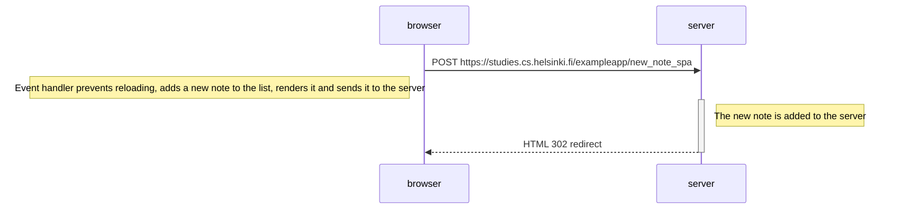

```mermaid
sequenceDiagram
    participant browser
    participant server

    browser->>server: POST https://studies.cs.helsinki.fi/exampleapp/new_note_spa
    note left of browser: Event handler prevents reloading, adds a new note to the list, renders it and sends it to the server
    activate server
    note right of server: The new note is added to the server
    server-->>browser: HTML 302 redirect
    deactivate server
```
